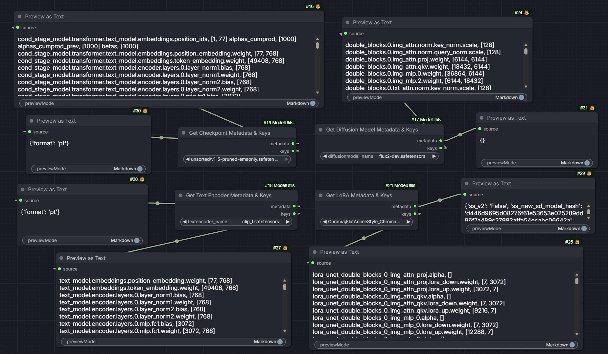
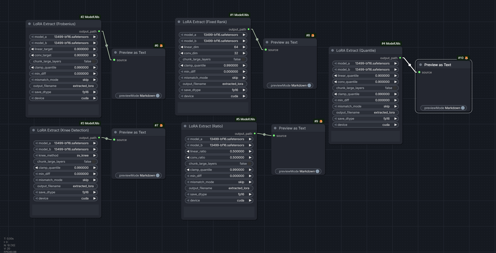
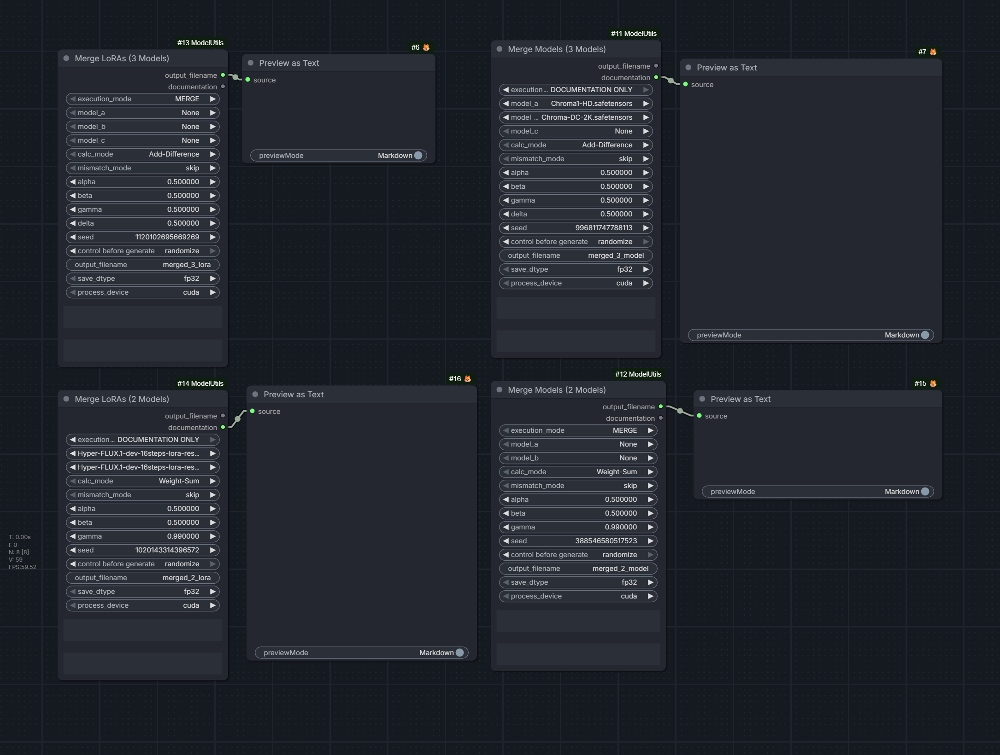
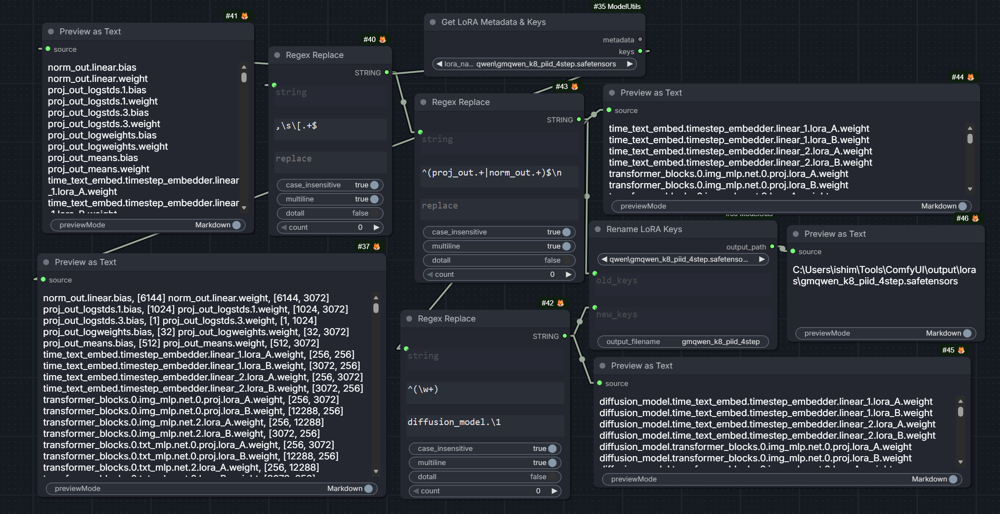

# ComfyUI-ModelUtils

A collection of ComfyUI custom nodes for inspecting, modifying, merging, and creating model files. Supports Models, TextEncoders, LoRAs, Checkpoints, and Embeddings.

## Features

- **MetaKeys** – Inspect and display metadata and tensor keys from model files
- **RenameKeys** – Batch rename tensor keys using pattern matching
- **PruneKeys** – Remove unwanted layers/keys from models
- **Mergers** – Combine 2 or 3 models with configurable blend modes and ratios
- **LoRA Extraction** – Extract LoRA adapters from model pairs using various SVD rank selection methods (Fixed, Ratio, Quantile, Knee-detection, Frobenius-norm)

## Example Workflows

  
   
  <a href="example_workflows/GetMetaAndkeys.json">📥 GetMetaAndkeys.json</a>

---

  
   
  <a href="example_workflows/LoRA_Extract_nodes.json">📥 LoRA_Extract_nodes.json</a>

---

  
   
  <a href="example_workflows/Merging_Examples.json">📥 Merging_Examples.json</a>

---

  
   
  <a href="example_workflows/RenameKeysInModel.json">📥 RenameKeysInModel.json</a>

## Acknowledgements

The LoRA extraction functionality was inspired by and references the excellent work from:

- [kohya-ss/sd-scripts](https://github.com/kohya-ss/sd-scripts) – Training scripts for Stable Diffusion
- [KohakuBlueleaf/LyCORIS](https://github.com/KohakuBlueleaf/LyCORIS) – Advanced LoRA techniques
- [bmaltais/kohya_ss](https://github.com/bmaltais/kohya_ss) – Windows-friendly GUI for sd-scripts

## License

See [LICENSE](LICENSE) for details.
